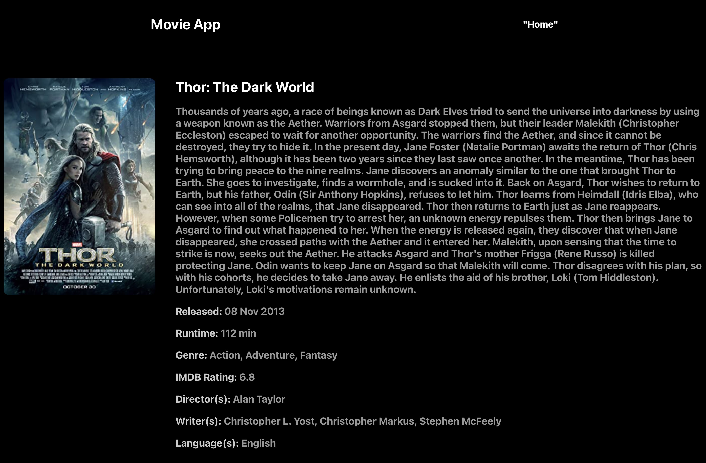

# movie-hunter

This project is a React application with functions to search for movies and add movies to favorites using OMDb API.
This app is trying to use latest React feature and Redux Toolkit and React Query abilities. It is also using Context Api to store some key data across the application!
Happy Movie Hunting!

# Home Page

  

# Favorites Page

  

# Detail Page

  

# Project setup

### `npm install`

# Project start

### `npm run start`